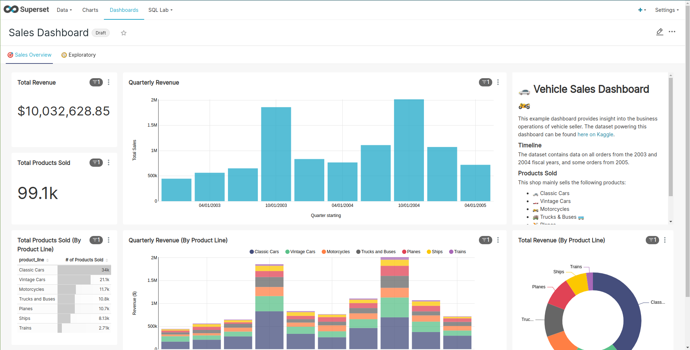
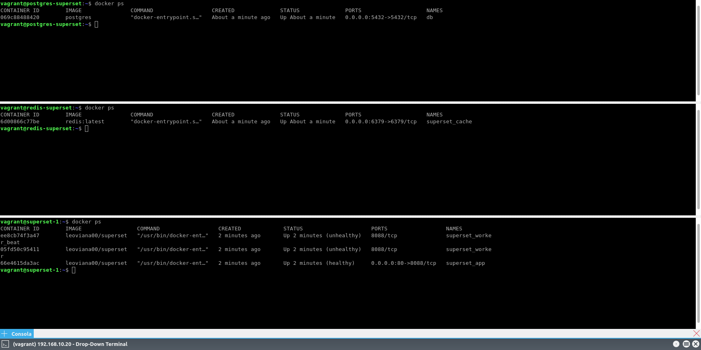
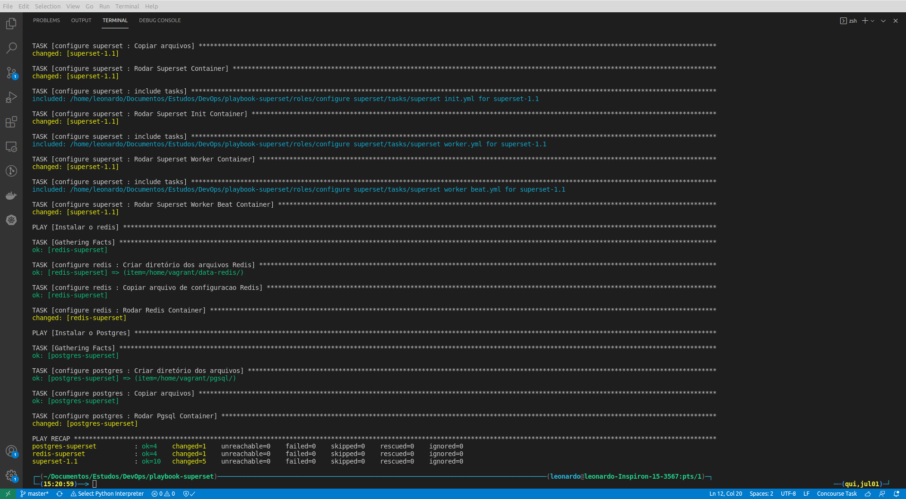
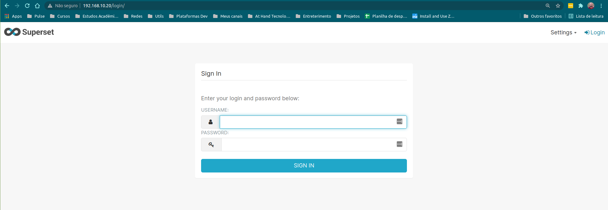

<h1 align="center">Superset</h1>

<p align="center">
  

  

  
</p>

<p align="center">
  <a href="#-projeto">Projeto</a>&nbsp;&nbsp;&nbsp;|&nbsp;&nbsp;&nbsp;
  <a href="#-tecnologias">Tecnologias</a>&nbsp;&nbsp;&nbsp;|&nbsp;&nbsp;&nbsp;
  <a href="#%EF%B8%8F-ambiente">Ambiente</a>&nbsp;&nbsp;&nbsp;|&nbsp;&nbsp;&nbsp;
  <a href="#-execução">Execução</a>&nbsp;&nbsp;&nbsp;|&nbsp;&nbsp;&nbsp;
  <a href="#-referências">Referências</a>
</p>

<p align="center">
  
</p>

## 🌱 Projeto

- Playbook para subir um superset na versão: `1.2`

## ✨ Tecnologias

- [Superset](https://github.com/apache/superset/tree/1.1)
- [Vagrant](https://www.vagrantup.com/)
- [Virtualbox](https://www.virtualbox.org/)
- [Docker](https://www.docker.com/)
- [Ansible](https://docs.ansible.com/ansible/latest/index.html)

## 🛠️ Ambiente 

- Para criar um ambiente para teste fui utilizado o `vagrant` e `virtualbox`.

<p align="center">
  
</p>

## 🚀 Execução

- Foram ciradas 4 roles:

1. Para configuração dos Hosts;
2. Para configuração do Postgres;
3. Para configuração do Redis;
4. Para configuração do SUperset;

- Rodando os playbooks:

```bash
$ ansible-playbook -i inventories/virtualbox.yml site.yml --tags setup,pgsql,redis,superset
```

<p align="center">
  
</p>

- URL: http://192.168.10.20/
- User: `admin`
- Senha: `admin`

<p align="center">
  
</p>

## 🙇 Referências

- [Superset](https://github.com/apache/superset/tree/1.2/docker)
- [Superset Image](https://hub.docker.com/layers/apache/superset/1.2.0/images/sha256-853561074b0ba40e78fb1d56d6daeea9d502198eda264507cb810f3de3c4f2b9?context=explore)